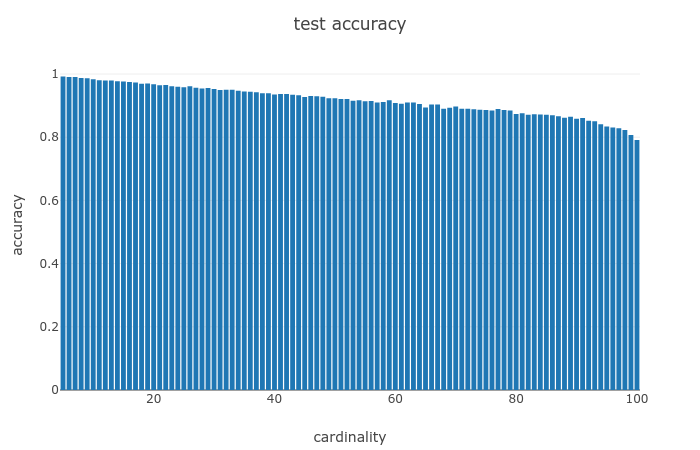

# digitsum
Sum of handwritten digits (MNIST), implemented in PyTorch.

The approach is based on the [Deep Sets paper](https://arxiv.org/abs/1703.06114), by Zaheer *et al.* The orginal implementation by the authors (using Keras) is available [here](https://github.com/manzilzaheer/DeepSets/blob/master/DigitSum/image_sum.ipynb).

This repo includes a complete implementation of both the Permutation Equivariant and Permutation Invariant layers, available in ``deepsetlayers.py``.

## Data acquisition
We use the [InfiMNIST digits](https://leon.bottou.org/projects/infimnist) exactly as described [here](https://github.com/manzilzaheer/DeepSets/tree/master/DigitSum). For your convenience, you may use our `infimnist_parser.py` to parse the InfiMNIST binaries. This was adapted from [this script](https://github.com/CY-dev/infimnist-parser/blob/master/infimnist_parser.py) from Congrui Yi in order to produce precisely the required files to run our model.

## Usage
Training and testing: `python image_sum.py --train=1`

Testing only: `python image_sum.py`

The following optional arguments may be passed to `image_sum.py`:

    -h, --help         show this help message and exit
    -t , --train       train the model
    -o , --output      output model file
    -d , --data_path   data directory
    --n_train          number of training examples
    --n_test           number of test examples
    --n_valid          number of validation examples
    --max_size_train   maximum size of training sets
    --min_size_test    minimum size of test sets
    --max_size_test    maximum size of test sets
    --lr               learning rate
    --epochs           number of training epochs
    --batch_size       batch size
    --use_cuda         use CUDA capable GPU
    --use_visdom       use Visdom to visualize plots
    --visdom_env       Visdom environment name
    --visdom_port      Visdom port

## Results
Using the default parameters, one obtains better results than those reported in the paper. This is mostly due to the fact that we use a CNN instead of an MLP to extract image features. The test accuracy for set cardinalities between 5 and 100 is shown below.

  

